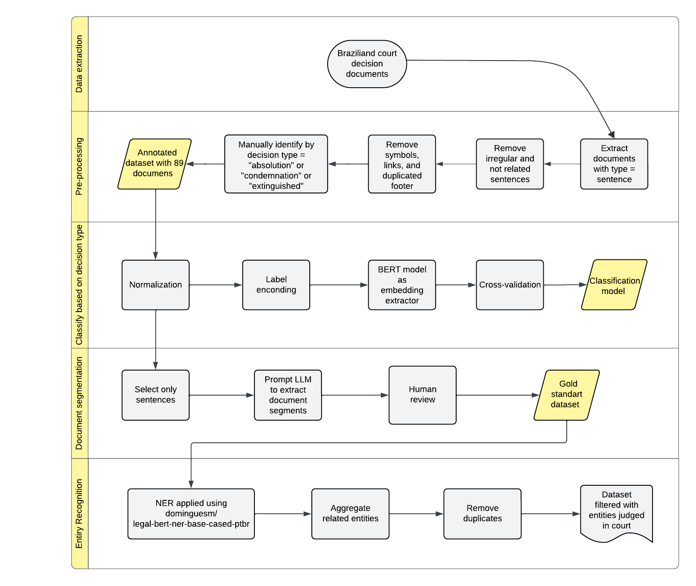

# A Multi-Layer Document Filtering and Structured Information Extraction Framework for Criminal Labor-Law Decisions

Este repositório é um trabalho em andamento de mestrado que deverá ser publicado em um dos seguintes journals:

- Information Processing & Management
- Neurocomputing
- Knowledge-Based Systems
- Expert Systems with Applications

Gostaria que o rigor técnico e científico do trabalho fosse digno de revistas de computação de algo nível (Qualis A1-A2)

## Resumo breve do trabalho

Realizar correlação indireta entre empresas na cadeia de suprimentos no brasil ainda é um desafio complexo.
Em cenários que queremos investigar relação de empresas que cometaram algum crime com outras empresas na cadeia de suprimentos, não conseguimos uma base de dados de transações entre elas.
Se não conseguirmos provas concretas de relação não há a possiblidade de conectar essas empresas.
Uma alternativa para a construção seria obter informações disponíveis sobre as empresas de múltiplas fontes e realizar conexões com os dados obtidos.
Para isso, nesse trabalho propõe-se elaborar uma pipeline de processamento de dados jurídicos utilizando modelos de IA para obter dados das empresas julgadas.
Dessa forma, foi sugerido a análise de alguns processos jurídicos que contem decisões judicias sobre casos de escravidão moderna na cadeia de suprimentos.
O objetivo da tarefa é analisar automaticamente decisões judiciais utilizando técnicas de NER (Named Entity Recognition) para identificar detalhes sobre crime, a pena, o local, os envolvidos, etc.
Esses dados poderão complementar aqueles extraídos de outras fontes como a lista suja.

## Base de dados

A base de dados conta com 2581 documentos jurídicos.
Dentre eles, nem todos são decisões/sentenças, tem-se despachos, atos ordinários e atas de audiência. Portanto, é necessário uma **análise em múltiplas camadas** antes de extrair as entidades nomeadas ou o modelo irá errar muito.
O interesse dessa extração é exclusivo de **sentenças**, porque é garantido que o réu cometeu o crime e de qualquer forma, qualquer outro tipo de documento não contem as informações relevantes para o estudo.

## Metodologia

A base de dados obtida contém tipos de documentos que não são relevantes para o experimento. Portanto, é necessário realizar uma filtragem em múltiplas camadas para obter os documentos relevantes para a extração de informações.

A Figura acima é um diagrama de atividades que ilustra a pipeline completa da tarefa.

### Classificação por tipo de documento

A etapa inicial será de classificação dos documentos por tipo e extrair apenas os que contem decisões judiciais (a princípio, sentenças e acórdãos).
Em seguida, para melhorar a performance do modelo é desejável a segmentar os documentos nas partes alvo para isolar as partes na qual o modelo deverá procurar por informações específicas. Penas só aparecem em **sentenças e acórdãos**, nosso interesse inicial se restringe a esses grupos (minoria na base de dados).
Acódãos serão descosiderados para a etapa de classificação de mérito penal, porque eles não trazem informações relevantes para o estudo, e geralmente são decisões de recursos, ou seja, reavaliação de uma sentença, portanto, não trazem informações adicionais.
No entanto, dentre os documentos de sentenças, podem haver aquelas com mérito penal, faz-se necessário aprofundar nessa discussão.
Para fazer isso da melhor forma, seria necessário um **especialista analisar manualmente cada caso**, ou pelo menos um **conjunto de casos** que possam servir de treinamento para um **modelo transformer**.

No código da pipeline, esta macro-etapa foi consolidada em duas subetapas sequenciais: **stage1_1** (classificação/normalização do tipo documental já conhecido na extração, com filtragem final apenas de sentenças) e **stage1_2** (pré-processamento textual com duas saídas, uma para classificação e outra para segmentação/NER).

Essa organização evita duplicidade entre "etapa 1" e "etapa 2" quando a tipologia documental já está disponível no dado bruto.

Resultando em 99 sentenças.

Na implementação atual, o `stage1_2` gera dois datasets distintos a partir de `files/output/dataset_filtered_by_type.csv`:

- `files/output/dataset_normalized.csv`: versão mais agressiva para classificação de mérito.
- `files/output/dataset_normalized_for_ner.csv`: versão mais simples para segmentação e NER, preservando padrões relevantes.

Ambas as saídas aplicam a remoção de rodapés duplicados do PJe (por exemplo: "Num. ... - Pág. ...", "Assinado eletronicamente por ...", URL de consulta pública, "Número do documento ...", e "Documento id ...").

### Filtragem por decisão por mérito penal

Esta etapa do trabalho consiste na identificação e filtragem de documentos que tratam especificamente de decisões de mérito penal no contexto do trabalho análogo à escravidão. Para fins desta análise, considera-se **condenação penal** todo documento que examine a responsabilidade penal do réu, com enquadramento no **artigo 149 do Código Penal**, independentemente do desfecho do processo.
Nesse sentido, foram incluídos documentos cujas decisões resultaram em condenação, absolvição, indeferimento ou extinção da punibilidade.
-> Sentenças e acórdãos sobre recursos (embargos de declaração) serão desconsiderados da análise atual como mencionado anteriormente.
O recurso poderá ser aberto contra uma condenação ou contra uma absolvição. O objetivo aqui é obter informações de condenações, recursos re-avaliam as informações, geralmente não trazem informações adicionais, portanto, é sensato removê-los da análise.
-> Observação quanto a casos de condenação parcial. Na minha opinião, quando houve a condenação de alguma das partes envolvidas com base no artigo 149, entraria como condenação. Para o treinamento do modelo de classificação de mérito penal, serão consideradas apenas três categorias (absolvição, condenação e extintos). As demais podem ser removidas nas etapas de pré-processamento.

### Segmentação de sentenças

Essa etapa foi realizada para determinar os segmentos dos documentos jurídicos e foi realizada utilizando a seguinte sequencia: criação do gold standard, anotação utilizando uma llm (Gemini Pro 2.5) E a avaliação humana após a análise da llm.

### NER

No `stage4_ner`, a extração de entidades nomeadas é realizada com o modelo BERT pré-treinado `dominguesm/legal-bert-ner-base-cased-ptbr` (token-classification via HuggingFace `transformers.pipeline`).

**Entrada**: `files/Documentos-Segmentados/resultado_anotacao.json` — objeto JSON com array `resultados`, onde cada documento possui `doc_id` e um array `dados` de registros sentenciais (`sentenca`, `label`).

**Sliding window para sentenças longas**: Sentenças que excedem o limite de 510 tokens do modelo (512 menos CLS/SEP) são processadas com uma janela deslizante (window=510, stride=256 tokens). Cada chunk é decodificado de volta ao texto, as entidades são extraídas e seus offsets de caracteres são mapeados de volta à sentença original. Entidades duplicadas na região de sobreposição entre janelas são mescladas por span e label, mantendo o maior score de confiança. Cada registro sentencial inclui um campo `windowed` indicando se a janela deslizante foi necessária.

**Saídas** (quatro arquivos):
- `files/NER/ner_results.json` — array de registros por sentença, cada um com `doc_id`, `id` (sequencial), `sentenca`, `label` (seção), `entidades` (lista de spans com text/label/start/end/score), `num_entidades` e `windowed`.
- `files/NER/ner_results.csv` — versão achatada com uma linha por entidade, incluindo colunas `doc_id`, `id`, `sentenca`, `secao`, `windowed`, `entidade_texto`, `entidade_label`, `entidade_start`, `entidade_end`, `entidade_score`.
- `files/NER/ner_results_by_document.json` — agregação por documento com entidades deduplicadas por par `(text, label)` mantendo o maior score. Estrutura: `[{"doc_id": N, "total_entities": N, "extracted_entities": [...]}]`.
- `files/NER/ner_results_by_section.json` — agrupamento por documento e seção, com entidades organizadas por tipo (entity label). Para cada par `(doc_id, section)`, as entidades são deduplicadas por `(text, label)` e agrupadas em `entities_by_type` (e.g. `PESSOA`, `LOCAL`, `TEMPO`, `LEGISLACAO`, `ORGANIZACAO`). Entidades co-ocorrentes na mesma seção (especialmente DOS_FATOS e DISPOSITIVO) possuem relação semântica implícita, permitindo inferir conexões como qual pessoa cometeu qual crime em qual local.

### Visualizações NER (stage4-viz)

O subcomando `stage4-viz` gera artefatos visuais a partir de `files/NER/ner_results_by_section_v2.json`:

- **Heatmap composto** (`output/images/fig2_ner_heatmap.{png,pdf}`): matriz seção × tipo de entidade com totais marginais (linha e coluna). Os totais por coluna substituem um gráfico de barras separado para distribuição de tipos de entidade, condensando duas visualizações em uma única figura de alta densidade informacional.
- **Tabela LaTeX** (`output/tables/table_ner_single_doc.tex`): extração detalhada de entidades para um documento representativo (configurável via `--doc-id`), destinada a apêndice do artigo.

Uso: `python -m framework stage4-viz [--input-by-section FILE] [--output-root DIR] [--doc-id N]`

O código está em `src/framework/stage4_ner_viz.py`.

## Estrutura de pastas

Na pasta src estão os códigos utilizados para realizar as atividades descritas acima, como a classificação por tipo de documento, a filtragem por mérito penal, a segmentação de sentenças e a aplicação do modelo NER.

Na implementação atual, a primeira macro-etapa aparece como `stage1_1` e `stage1_2`, para refletir melhor o encadeamento do diagrama de atividades e a origem das informações de tipo documental.
Na versão atual do código, as rotinas de classificação anteriormente na etapa 3 foram renumeradas para `stage2` (abordagem com embeddings BERT + classificadores clássicos), a segmentação foi consolidada em `stage3` e a extração NER ficou como etapa final em `stage4`.
No `stage2_embeddings`, o texto normalizado é convertido em embeddings com um modelo BERT jurídico (encoder), e em seguida são treinados classificadores clássicos (Logistic Regression, SVM, Random Forest e XGBoost) para prever o tipo de decisão de mérito, com foco nas classes `condenação`, `extinto` e `absolvição`.
Essa etapa imprime métricas no terminal e também exporta artefatos para análise no paper: tabela em LaTeX (`output/tables/table.tex`) e matrizes de confusão por modelo (`output/images/matriz_confusao_*.png`).
Uma variante com fine-tuning chegou a ser testada, mas foi removida da pipeline principal devido à baixa quantidade de exemplos rotulados e alta instabilidade dos resultados.

#### Baseline LLM (stage2_llm_baseline)

Para contextualizar os resultados do `stage2_embeddings` frente a modelos de linguagem de grande escala, foi adicionado um baseline utilizando o Gemini Pro 2.5 com duas variantes: **zero-shot** e **few-shot** (3 exemplos por classe).

- **Prompt**: `src/prompts/prompt_classification_merit.txt` — enquadra o artigo 149 do Código Penal e as três classes-alvo (`condenação`, `absolvição`, `extinto`), solicitando resposta em JSON `{"decisao": "<categoria>"}`.
- **Avaliação**: utiliza os mesmos splits estratificados K-fold (mesmo seed=42) do `stage2_embeddings` para garantir comparabilidade direta. Apenas os documentos do test fold são classificados pela LLM.
- **Few-shot**: os exemplos são amostrados do training fold de cada iteração (evitando data leakage), priorizando documentos mais curtos para caber no contexto da LLM.
- **Fallback**: em caso de falha após 3 tentativas, a classe majoritária é atribuída (abordagem conservadora que penaliza a LLM, não infla resultados).
- **Saídas**: `output/stage2_llm_baseline_results.json`, `output/tables/table_llm_baseline.tex` e matrizes de confusão em `output/images/matriz_confusao_gemini_*.png`.

O argumento metodológico esperado: se o pipeline BERT+SVM igualar ou superar a LLM zero-shot/few-shot, demonstra-se que a abordagem de embeddings é mais estável sob desbalanceamento de classes, com custo computacional significativamente menor e resultados reprodutíveis.
No `stage3_segmentation`, o dataset `files/output/dataset_normalized_for_ner.csv` é usado como entrada, com filtragem padrão para `decisao=condenação` (subconjunto de interesse, ~25 documentos), e cada linha é enviada para uma LLM Gemini com um prompt-base em `src/prompts/prompt_segmentation.txt` para gerar a segmentação estruturada em JSON, salva em `files/Documentos-Segmentados/resultado_anotacao.json`.

Na pasta paper estão os arquivos relacionados à escrita do artigo, como o template em latex, o arquivo .bib com as referências e o arquivo .tex com o texto do artigo utilizando o template da primeira revista mencionada a Information Processing & Management.

Na pasta files estão os arquivos relacionados à base de dados, como o arquivo .csv com os documentos jurídicos e o arquivo .json com as entidades extraídas utilizando o modelo NER:
    - files/datasets: dataset_completo.csv contendo os 2581 documentos jurídicos, com as seguintes colunas.
    - files/output: artefatos intermediários da pipeline (por exemplo `dataset_filtered_by_type.csv`, `dataset_normalized.csv` e `dataset_normalized_for_ner.csv`).
    - files/docs-condenacao: contendo os 25 documentos jurídicos classificados como condenação.
    - files/Documentos-Segmentados: contem os documentos de condenação segmentados pelo tipo, resultado da etapa de segmentação de sentenças.
    - files/NER: contendo os arquivos .json com as entidades extraídas utilizando o modelo NER.

## Tarefas pendentes

1. Organizar e realizar a limpeza do código para publicação. O esboço inicial do código foi feito usando o google colab, precisa ser convertido para uma estrutura de projeto mais organizada, com arquivos .py e uma estrutura de pastas mais clara.

2. Realizar a escrita do artigo utilizando o template da revista escolhida, inicialmente a Information Processing & Management.
    - Determinar a estrutura do artigo, quais seções serão utilizadas, quais informações serão apresentadas em cada seção, etc.
    - Escrever o texto do artigo, utilizando as informações obtidas nas etapas anteriores, como a metodologia, os resultados, a discussão, etc.
    - Realizar a revisão do texto para garantir que o rigor técnico e científico do trabalho seja digno de revistas de computação de algo nível (Qualis A1-A2).

3. Realizar um estudo comparativo com pelo menos três artigos semelhantes para comparar os resultados obtidos com os resultados de outros trabalhos na área, para destacar as contribuições do trabalho e identificar possíveis limitações.

## Ferramentas utilizadas

python: para produção do código
latex: para escrita do artigo
scopus: para obtenção dos artigos relacionados ao tema do trabalho

### Apendice

#### Query do Scopus para obtenção dos artigos com a construção de frameworks de AI semelhantes - filtrados por decisões judiciais

query textual:
"machine learning" OR "learning of machine" OR "NLP" OR "natural language processing" OR "NER" OR "Named entity recognition"

AND

"court decision" OR "legal documents" OR "legal decisions"

AND

framework

critérios de busca:

- 2021 - 2026
- em ingles
- ordenados por quantidade de citações
- artigos de periódico
- remover artigos com < 50% de percentil ou < 100 citações

obtive 45 artigos

Especifiquei mais por NER, dado que quero comparar com minha abordagem obtive 3 artigos para análise.

#### Query do Scopus para obtenção dos artigos com a construção de frameworks de AI semelhantes

query textual:
"machine learning" OR "learning of machine" OR "NLP" OR "natural language processing" OR "NER" OR "Named entity recognition"

AND

framework

critérios de busca:

- 2021 - 2026
- em ingles
- ordenados por quantidade de citações
- artigos de periódico
- remover artigos com < 50% de percentil ou < 100 citações

obtive 45 artigos

Especifiquei mais por NER, dado que quero comparar com minha abordagem obtive 3 artigos para análise.

#### Query do Scopus para obtenção dos artigos de filtragem e classificação de documentos jurídicos

query textual:
"Legal document" AND "filtering" AND "classification"

critérios de busca:

- 2021 - 2026
- em ingles
- ordenados por quantidade de citações
- artigos de periódico
- remover artigos com < 50% de percentil ou < 100 citações

Obtive 3 artigos para análise.

#### Query do Scopus para obtenção dos artigos de segmentação de documentos jurídicos

query textual:
"Legal sentences" or "legal documents" or "legal texts" AND "segmentation"

critérios de busca:

- 2021 - 2026
- em ingles
- ordenados por quantidade de citações
- artigos de periódico
- remover artigos com < 50% de percentil ou < 100 citações